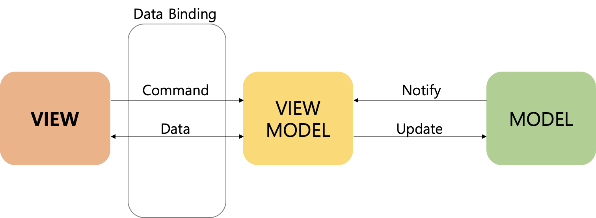

# 1. MVVM 패턴




> MVVM 패턴을 바탕으로 Base Class들을 작성하여 사용
>
> **View** - BaseActivity, BaseFragment
> **ViewModel** - BaseViewModel
> **Model** - Data Class, Retrofit2 등

# 2. Class 설명

- ## [BaseActivity](https://github.com/Hulrara/android_base/blob/master/app/src/main/java/kr/taehoon/baseapplication/base/BaseActivity.kt)


  ```kotlin
  abstract class BaseActivity<T : ViewDataBinding> : AppCompatActivity(){
       abstract val layoutResourceId: Int
       lateinit var viewDataBinding: T
       abstract fun initAfterBinding()
       abstract fun setObserver()
  }
  ```

  > 해당하는 View와 결합할 **ViewDataBiding Type -> Generic T**
  > 구현 Class에서 **layoutResourceId** 에 해당 Activity의 LayoutResId을 입력하고, **initAfterBinding()** 함수에 View가 Binding된 이후 수행해야 될 작업을 기입한다.
  > **setObserver()** 함수는 ViewModel의 LiveData 또는 ReactiveX의 Observer를 구현한다.

- ## [BaseFragment](https://github.com/Hulrara/android_base/blob/master/app/src/main/java/kr/taehoon/baseapplication/base/BaseFragment.kt)

  ```kotlin
  abstract class BaseFragment<T: ViewDataBinding> : Fragment(){
       abstract val layoutResId : Int
       lateinit var viewDataBinding: T
       abstract fun initOnCreatedView()
       abstract fun initOnViewCreated()
  }
  ```

  > BaseActivity와 거의 동일하게 구현

  

- ## [BaseViewModel](https://github.com/Hulrara/android_base/blob/master/app/src/main/java/kr/taehoon/baseapplication/base/BaseViewModel.kt)

  ```kotlin
  abstract class BaseViewModel : ViewModel()
  ```

  > 여러 ViewModel의 공통 작업들을 캡슐화하여 확장성에 중점을 둔 Class
  > ex) Rest통신을 위한 retrofit2 DI, Rx 구독 해제

  

- ## [BaseRecyclerAdpater](https://github.com/Hulrara/android_base/blob/master/app/src/main/java/kr/taehoon/baseapplication/base/BaseRecyclerAdapter.kt)

  ```kotlin
  abstract class BaseRecyclerAdapter<ITEM : Any?, VD : ViewDataBinding>{
       abstract val layoutResourceId: Int
       abstract fun onCreateCoreViewHolder(binding: VD, viewType: Int): BaseViewHolder<ITEM>
  }
  ```

  > 대부분의 Application에서 RecyclerView는 필수요소이기때문에, 공통 구현 부분 캡슐화을 통해 작업성 향상 **(해당 Class는 ViewType이 한개인 경우만 사용가능)**
  > ViewHolder에 Binding될 Data의 Type -> **Generic ITEM**
  > ViewHolder의 View와 결합할 ViewDataBiding Type -> **Generic VD**
  > **onCreateCoreViewHolder()** 는 결합된 ViewDataBinding과 viewType을 입력받아 ViewHolder를 생성하여 리턴한다.

  

- ## [BaseViewHolder](https://github.com/Hulrara/android_base/blob/master/app/src/main/java/kr/taehoon/baseapplication/base/BaseViewHolder.kt)

  ```kotlin
  abstract class BaseViewHolder<T:Any?>(override val containerView: View) :RecyclerView.ViewHolder(containerView),LayoutContainer {
       abstract val binding: ViewDataBinding
       abstract fun bind(itemData: T?, position: Int)
  }
  ```

- ## [BaseViewHolder](https://github.com/Hulrara/android_base/blob/master/app/src/main/java/kr/taehoon/baseapplication/base/BaseViewHolder.kt)

  ```kotlin
  abstract class BaseViewHolder<T:Any?>(override val containerView: View) :RecyclerView.ViewHolder(containerView),LayoutContainer {
       abstract val binding: ViewDataBinding
       abstract fun bind(itemData: T?, position: Int)
  }
  ```

  > BaseRecyclerAdpater와 한쌍으로 ViewHolder를 위한 Binding Class
  > ViewHolder에 Binding될 Data의 Type -> **Generic T**
  > 구현 class에서 **bind()** 함수에 구현

- ## [AppModule.kt](https://github.com/Hulrara/android_base/blob/master/app/src/main/java/kr/taehoon/baseapplication/util/AppModule.kt)
  > Koin 라이브러리를 사용하여 DI Module 구현

- ## [BindingAdapterUtil](https://github.com/Hulrara/android_base/blob/master/app/src/main/java/kr/taehoon/baseapplication/util/BindingAdapterUtil.kt)
  > BindingAdapter를 활용하여 View의 Custom 속성 구현
